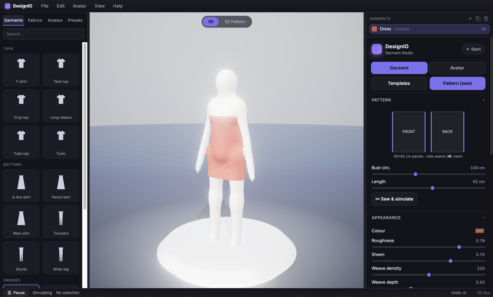

# DesignIO

**A personal, fully-3D clothing design studio** — in the spirit of [CLO3D](https://www.clo3d.com/en/) and
[Browzwear](https://browzwear.com/) — for designing your own clothes realistically and virtually. Built
as a desktop app with **Electron + Three.js + TypeScript**.

Design garments on a slim, poseable human mannequin, dress them in real fabrics with **live cloth
physics**, shape the body, animate it, and export the result — all in a photographic studio scene.

> ### 🚧 Development stage
> **DesignIO is an active work-in-progress.** It runs and is genuinely usable, but it is under heavy
> development: features are experimental, APIs and visuals change frequently, and rough edges are
> expected. This is not a finished or released product.

**Author:** Zayan Khan · **Contact:** [khanzayan_123@hotmail.com](mailto:khanzayan_123@hotmail.com)

---

## ⚖️ License & usage — all rights reserved

© 2026 **Zayan Khan**. All rights reserved.

This repository and **everything in it** (source code, designs, assets, and ideas) is **proprietary and
private**. It is **not** open source and carries **no license to use it**.

**You may not** use, run, copy, clone, fork, modify, publish, distribute, reproduce, reverse-engineer, or
create derivative works from any part of this project — **in whole or in part** — **without explicit prior
written permission from the author.**

- Permission **must be requested in advance**, by email, **before** any such use.
- **Contact for permission:** **Zayan Khan — [khanzayan_123@hotmail.com](mailto:khanzayan_123@hotmail.com)**
  (or any other means of contacting the author).
- **Unauthorized use, copying, or distribution may result in legal action.**

If you are unsure whether something is allowed, **ask first.**

---


*The homepage launcher: start a **New design**, or jump straight in from a **template**.*


*The "Design your piece" builder: pick from a categorised garment catalog, choose a fabric, and see a
live 3D preview draped on the mannequin — then open it in the full studio.*

---

## What you can do right now

### Design your piece
Start on the **"Design your piece"** page: choose a garment, colour it, **add your own graphic + text**,
shape the mannequin, and set the fit — all with a **live, auto-rotating 3D preview**. Hit **Design in 3D →**
to open it in the full studio (and **← Start** to come back, keeping your design).

### A professional studio (CLO3D-style, but friendly)
The studio is a **dockable CAD-style workspace** — a top **menu bar**, a left **Library** (tabbed,
searchable: garments · fabrics · avatars · presets), a **dual central viewport** (**3D** · **2D pattern**),
a right **Object Browser** (scene pieces + show/hide) above a context-sensitive **Property Editor** (Garment
/ Avatar / Scene), and a **status bar** (live fps · simulate/pause). Panels **resize, collapse, and
persist**. Built vanilla (CSS + split.js) — with sensible defaults so it stays approachable, not
overwhelming.

### A real garment catalog — 16 garments, all data-driven
Garments are built from a **data-driven schema** (a registry of definitions composed from parametric
pieces), so breadth comes from data, not bespoke code. Grouped by category:

- **Tops** — t-shirt, tank, crop top, long-sleeve, tube top, tunic
- **Bottoms** — A-line / pencil / maxi skirt, trousers, shorts, wide-leg
- **Dresses** — dress, sheath, slip, gown
- **One-pieces** — jumpsuit

The construction panel is **schema-driven**: each garment shows only the controls it supports —
**neckline** (scoop / crew / V / strapless), **sleeves** (short / long), **length**, **looseness**, and
**flare**. Tops & dresses get shoulder coverage + cinched waists; the jumpsuit is a torso + two legs.

| Gown (strapless satin) | Jumpsuit (denim, one-piece) |
| --- | --- |
|  |  |

### Two slim model mannequins — and full body shaping
Design on a clean, matte **studio mannequin** with a smooth featureless (store-mannequin) head. Pick a
**female** or **male** figure — both slim and elongated like runway models — then **shape the body**:
height, overall build, and independent **bust / waist / hips** to create real body shapes.

| Female model | Male model |
| --- | --- |
|  |  |

### Real 3D drape with mesh-accurate collision
Each garment **simulates** with an **XPBD** cloth solver and collides against the **true body surface**
(a BVH over the mannequin mesh) plus skeleton capsules — so it hugs the real silhouette, sleeves sit on
the arms, and skirts flare naturally. Cloth normals are recomputed every frame for smooth shading.


### A comprehensive fabric library — 24 fabrics by family
Every fabric carries **physical** properties (weight, stretch, bendiness, friction) that drive the
**drape**, and **visual** properties (weave, sheen, anisotropy, sheerness, roughness) that drive the
**material** — so the *same garment drapes differently* on stiff denim vs fluid chiffon.

- **Wovens** — poplin, oxford, chino twill, denim, canvas, corduroy, linen, wool flannel, tweed
- **Silks & smooth** — charmeuse, satin, crepe, organza, chiffon
- **Knits** — jersey, rib, French terry, fleece, cable knit
- **Specialty** — leather, suede, velvet, tulle, spandex


*Every fabric drives both look and drape — here, velvet.* Live-inspect any fabric (GSM, stretch, drape,
grip, roughness, sheen, weave density/depth, anisotropy, sheerness), and macro-zoom to see the woven
micro-surface:


### Pattern (sew) mode — the CLO3D loop
Adjust flat **FRONT / BACK panels** (bust, length) and **Sew & simulate** — the panels stitch at the side
seams and wrap the body into a 3D garment.



### Animate it (4D) + export to get it made
Animate the mannequin — **idle / walk / turntable** — and watch the garment move with the body (a swinging
skirt, a flowing dress). Tune **gravity / wind / exposure**. Then **export**: **3D** (glTF / OBJ), **2D
pattern** (SVG / DXF for a cutter), and a **measurement tech-pack** (printable HTML + JSON).

---

## Run it

> Running this project requires the author's permission — see **[License & usage](#️-license--usage--all-rights-reserved)** above.

**Requirements:** Node.js 18+ (developed on Node 20/22) and npm.

```bash
npm install
npm run dev        # launch the DesignIO desktop app (Vite hot reload)
```

### Other commands

```bash
npm run build      # bundle main / preload / renderer into ./out
npm run preview    # build, then run the packaged app
npm test           # headless solver / geometry / catalog tests (vitest)
npm run typecheck  # strict TypeScript, no emit
npm run capture    # re-render all README screenshots from the current build
```

---

## How it's built

```
src/
  main/         Electron main process (window, native menu, CSP, save dialog)
  preload/      context-isolated bridge
  renderer/
    core/       Viewport (scene/camera/controls + post) · Environment (studio IBL, floor, pedestal) · Loop
    avatar/     Mannequin (poseable/resizable female+male body) · BodyMesh (metaball) · colliders
    cloth/      XPBDSolver · ClothWorld (sewn panels) · BodyCollider (mesh BVH) · Garment · FabricMaterial
    garments/   schema (GarmentDefinition) · registry (the catalog, as data) · factory (build from data)
    fabric/     FabricLibrary (24 fabrics by family) · weaveTexture (procedural weave normals)
    pattern/    2D panels → sew → drape
    export/     glTF/OBJ · SVG/DXF pattern · HTML/JSON tech-pack
    start/      StartPage ("design your piece") · PreviewStudio · design config · presets
    shell/      professional studio shell — StudioShell · menuBar · Library · ObjectBrowser · statusBar
    ui/         Property Editor (context-sensitive panel) · controls · thumbnails · design tokens + styles
tests/          headless solver / geometry / garment-catalog / fabric correctness
```

**Cloth model:** an XPBD (Extended Position-Based Dynamics) mass-spring solver — structural, shear and
bending distance constraints, integrated under gravity/wind in fixed substeps, with mesh-BVH body
collision + capsule broadphase + friction. Real-time, not offline finite-element — tuned for 60 fps.

**Data-driven catalog:** a garment is a `GarmentDefinition` (category + composable pieces + which
construction controls it supports). A factory turns it into simulated cloth. **Adding a garment or fabric
is a data change, not new code.**

---

## Roadmap

Shipped: data-driven garment schema + factory · 24-fabric library by family · 16-garment catalog with a
category picker + schema-driven construction UI · female/male slim models with bust/waist/hips shaping ·
mesh-accurate BVH body collision · a production-grade, consistent UI.

Planned (in phases): **4D** per-fabric secondary motion (lag/flutter vs near-rigid) + stability hardening ·
cloth **self-collision + thickness** · **layering / full outfits** (garment↔garment collision) · **tailored
outerwear** (lapels, collars, structured coats) · presets + export polish.

---

*DesignIO © 2026 Zayan Khan — all rights reserved. Ask before using: khanzayan_123@hotmail.com*
