# DesignIO

**A personal, fully-3D clothing design studio** — in the spirit of [CLO3D](https://www.clo3d.com/en/) and
[Browzwear](https://browzwear.com/) — for designing your own clothes realistically and virtually. Built
as a desktop app with **Electron + Three.js + TypeScript**.

Design garments on a slim, poseable human mannequin, dress them in real fabrics with **live cloth
physics**, shape and customize the body, animate it, and export the result — all in a photographic studio
scene, from a friendly launcher through a professional CAD-style workspace.

> ### 🚧 Development stage
> **DesignIO is an active work-in-progress.** It runs and is genuinely usable, but it is under heavy
> development: features are experimental, APIs and visuals change frequently, and rough edges are
> expected. This is not a finished or released product.

**Author:** Zayan Khan · **Contact:** [khanzayan_123@hotmail.com](mailto:khanzayan_123@hotmail.com)

---

## ⚖️ License & usage — all rights reserved

© 2026 **Zayan Khan**. All rights reserved.

This repository and **everything in it** (source code, designs, assets, and ideas) is **proprietary and
private**. It is **not** open source and carries **no license to use it**.

**You may not** use, run, copy, clone, fork, modify, publish, distribute, reproduce, reverse-engineer, or
create derivative works from any part of this project — **in whole or in part** — **without explicit prior
written permission from the author.**

- Permission **must be requested in advance**, by email, **before** any such use.
- **Contact for permission:** **Zayan Khan — [khanzayan_123@hotmail.com](mailto:khanzayan_123@hotmail.com)**
  (or any other means of contacting the author).
- **Unauthorized use, copying, or distribution may result in legal action.**

If you are unsure whether something is allowed, **ask first.**

---

## Table of contents

- [At a glance](#at-a-glance)
- [The homepage & "Design your piece"](#the-homepage--design-your-piece)
- [The professional studio — every panel](#the-professional-studio--every-panel)
- [The garment catalog — 31 garments](#the-garment-catalog--31-garments)
- [Construction detail](#construction-detail)
- [The fabric library — 24 fabrics](#the-fabric-library--24-fabrics)
- [Surface design & fabric finishes](#surface-design--fabric-finishes)
- [Per-part & per-panel fabric](#per-part--per-panel-fabric)
- [Prints, logos & text](#prints-logos--text)
- [The avatar — full customization](#the-avatar--full-customization)
- [Accessories, headwear & neckwear](#accessories-headwear--neckwear)
- [Real 3D cloth simulation](#real-3d-cloth-simulation)
- [The 2D flat pattern — both ways](#the-2d-flat-pattern--both-ways)
- [Layering, projects & files](#layering-projects--files)
- [Studio lighting & backdrops](#studio-lighting--backdrops)
- [Analysis & fit tools](#analysis--fit-tools)
- [Motion, poses & shots](#motion-poses--shots)
- [Sizing, measurements & the manufacturing pack](#sizing-measurements--the-manufacturing-pack)
- [Export everything](#export-everything)
- [Run it](#run-it)
- [How to ship it](#how-to-ship-it)
- [How it's built](#how-its-built)
- [Roadmap](#roadmap)

---

## At a glance

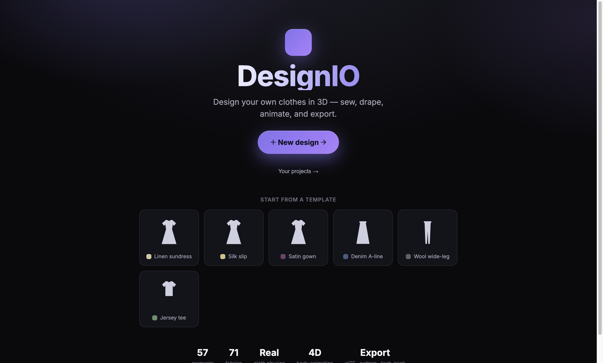

*The homepage launcher: start a **New design**, jump straight in from a **template**, or open **Your projects**.*

| What | DesignIO |
| --- | --- |
| **Garments** | 31 data-driven garments across tops · bottoms · dresses · one-pieces · outerwear · headwear |
| **Fabrics** | 24 real fabrics with physical **and** visual properties that drive both drape and look |
| **Body** | imported photoreal GLB avatar (default) or a sculpted metaball body — female/male, fully shapeable |
| **Simulation** | XPBD cloth · mesh-accurate BVH body collision · cloth self/inter-collision · 4D motion · trapped-air puffer loft |
| **Surface** | textiles · ombré · distressing · sequins · iridescence · quilting · lace · faux-fur · wet look · photo→PBR swatch |
| **Customize** | skin tones · hair · face · body presets · lookbook poses · accessories · headwear & neckwear |
| **Studio** | dockable CAD shell · 3D + 2D pattern + Render tabs · lighting & backdrop presets · fit / stress / pressure maps |
| **Output** | glTF · OBJ · USDZ (AR) · SVG/DXF pattern · tech-pack · manufacturing pack · PNG stills · WebM clips |

---

## The homepage & "Design your piece"

Entry is a **homepage launcher** → the **"Design your piece"** builder → the full **studio** (with **Your
projects** always a click away). The builder is the friendly front door: choose a garment, colour it,
**add your own graphic + text**, pick the **neckline · sleeves · size**, shape the mannequin, and set the
fit — with **Quick looks** (one-tap presets), a **Surprise me** randomiser, a **Spin** toggle, and an
aurora that **tints to your colour**, all on a **live, auto-rotating 3D preview**. Hit **Design in 3D →**
to open it in the full studio (and **← Start** to come back, keeping your design).

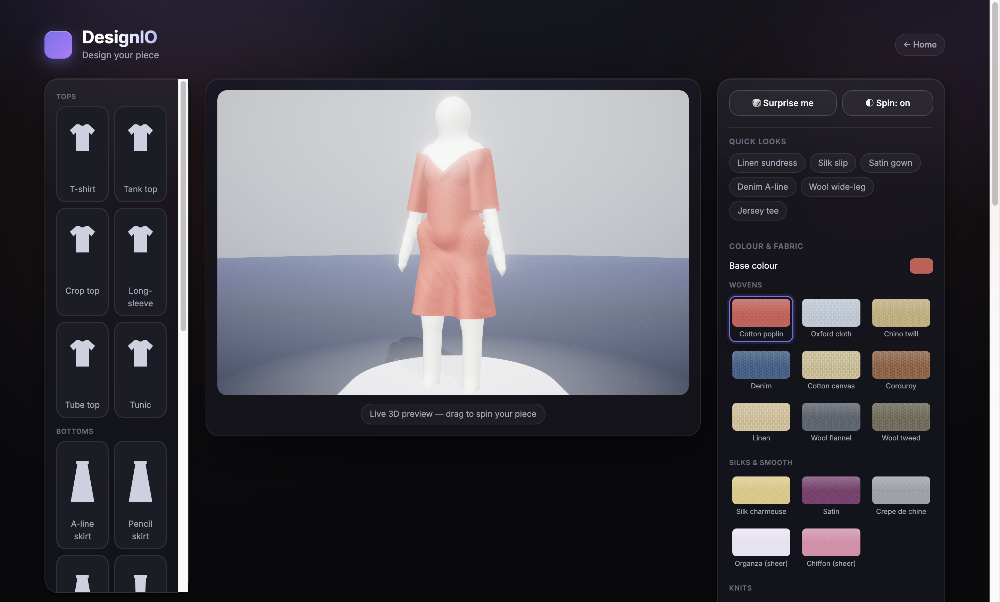

*Pick from a categorised garment catalog, choose a fabric, and see a live 3D preview draped on the
mannequin — then open it in the full studio.*

---

## The professional studio — every panel

The studio is a **dockable CAD-style workspace** built vanilla (CSS + split.js + localStorage) — every
region **resizes, collapses, and persists** across sessions, with sensible defaults so it stays
approachable, not overwhelming.

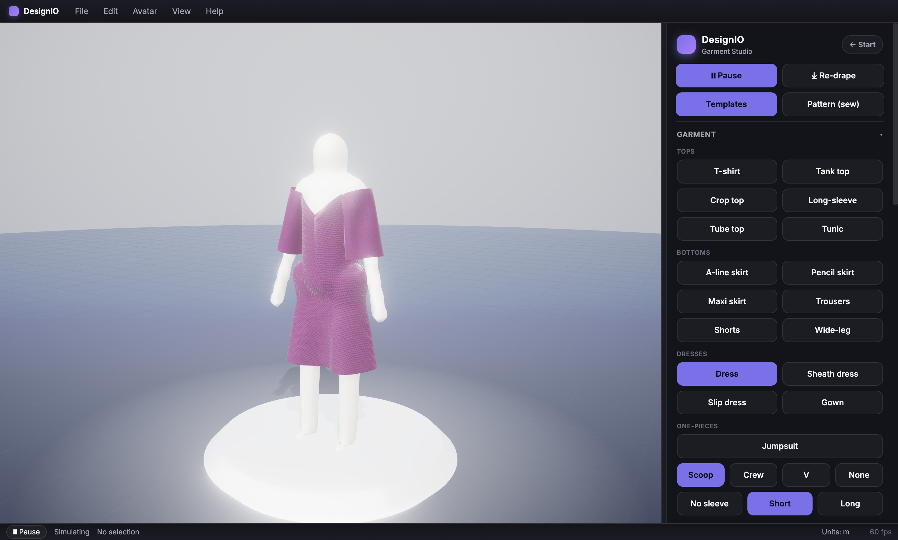

**The menu bar** (top) — **File** (New · Open/Save `.dio` project · every export), **Edit** (undo/redo ·
cut/copy/paste/duplicate/delete garment), **View**, **Avatar**, and **Help** (a keyboard-shortcuts overlay,
press `?` — every shortcut is **rebindable**: click its key chip, press a new combo; conflicts are caught
and "Reset to defaults" restores the stock map). Menu items grey out at their boundaries (nothing to undo,
empty clipboard, last garment).

**The left Library** — a tabbed, **search-as-you-type** asset browser:

| Tab | What's in it |
| --- | --- |
| **Garments** | the full 31-garment catalog, grouped by category, each a one-click add |
| **Fabrics** | all 24 fabrics — **filter** by family · weight · stretch, combined with the text search |
| **Avatars** | body type, presets and the mannequin options |
| **Presets** | curated looks to start from |

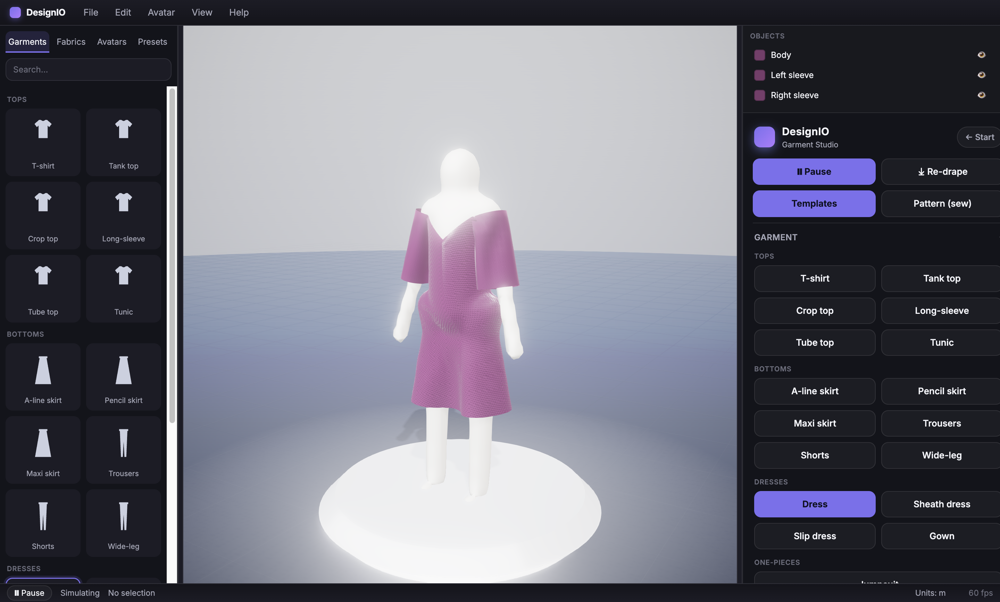

**The central viewport** — three tabs with a **persistent quick-edit toolbar floating over both** the 3D
and 2D views (size · neckline · sleeve · length · width · hem — every value **click-to-type** for exact
numbers):

- **3D** — the live simulated garment on the avatar.
- **2D Pattern** — the real flat pattern of the garment you designed (2D and 3D stay in sync).
- **Render** — supersample the current view to a crisp **HD / 2K / 4K** PNG and save it.

**The right dock** — an **Object Browser** (every garment worn on the body: select · show/hide · add ·
duplicate · delete) above a **context-sensitive Property Editor** that switches between three contexts:

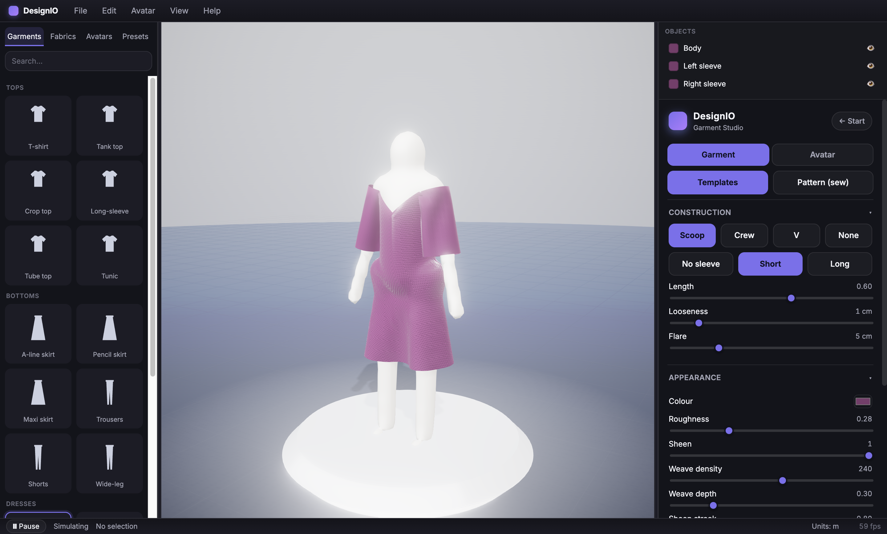

- **Garment** — size (XS–XXL) · neckline · sleeve + sleeve-shape · length · looseness · flare · the full
  **construction** toggle set · **part & panel fabric** · contrast trim · seam allowance + notches · the
  **Prints** manager · **appearance** (roughness · sheen · weave density/depth · anisotropy · sheerness) ·
  **physics** (weight · stretch · drape · grip) · **surface finishes** (textile · ombré · wear · sparkle ·
  iridescent · quilt · lace · fur · photo swatch) · **colorways**.
- **Avatar** — body type (female/male) · height · build · bust/waist/hips · **body presets** · **skin tone
  + undertone** · **hair + colour** · **face** · **accessories, headwear & neckwear** toggles · **lookbook
  pose** · **animation** (idle/walk/turn) + speed.
- **Scene** — **lighting preset** · **backdrop** · gravity · **wind preset** · exposure · and the **fit
  heatmap / stress / pressure-map / wrinkles** view toggles.

**The status bar** (bottom) — live **fps**, a **simulate / pause** toggle, and the working units.

First time in? An **onboarding tour** walks you through it — a spotlight ring highlights each region
(menu bar · Library · viewport · layers & properties · status bar) with a short explainer card. It runs
once automatically and is always re-openable from **Help → Take the tour**.

---

## The garment catalog — 31 garments

Garments are built from a **data-driven schema** (a registry of definitions composed from parametric
pieces), so breadth comes from data, not bespoke code. **Adding a garment is a data change, not new code.**
Grouped by category:

- **Tops** (9) — t-shirt, tank, crop top, long-sleeve, polo, tube top, tunic, blouse, hoodie (with a real draped hood)
- **Bottoms** (10) — A-line / pencil / maxi skirt, trousers, shorts, wide-leg, cargo, slim trousers, joggers, leggings
- **Dresses** (4) — dress, sheath, slip, gown
- **One-pieces** (1) — jumpsuit
- **Outerwear** (4) — blazer, coat, cardigan, bomber
- **Headwear & neckwear** (3) — a cloth-sim snood (cowl), beanie, and wrapped scarf that drape on the head/neck

The construction panel is **schema-driven**: each garment shows only the controls it supports —
**neckline** (scoop / crew / V / strapless), **sleeves** (short / long) with a **sleeve library** of shapes
(set-in · raglan · dolman · bishop · puff · bell), **length**, **looseness**, and **flare**. Tops & dresses
get shoulder coverage + cinched waists; the jumpsuit is a torso + two legs.

| Gown (strapless satin) | Jumpsuit (denim, one-piece) | Coat (outerwear, to the knee) |
| --- | --- | --- |
| 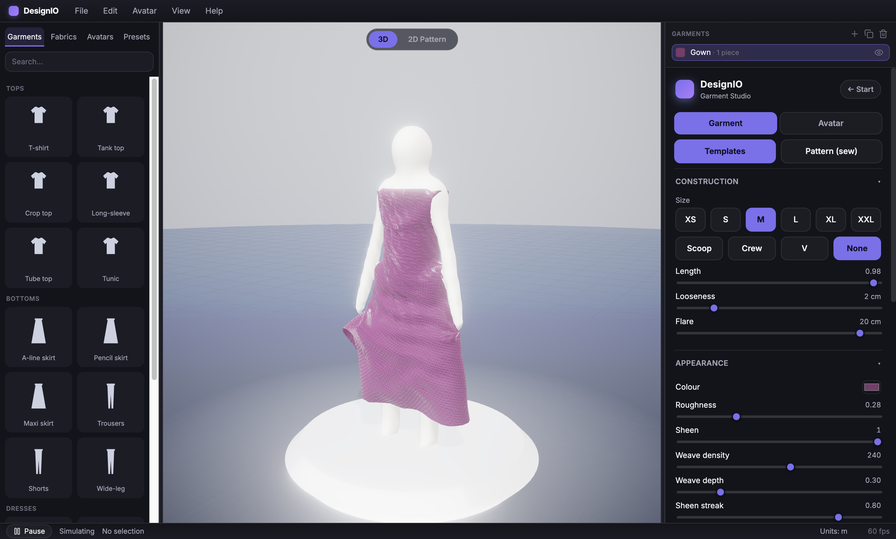 | 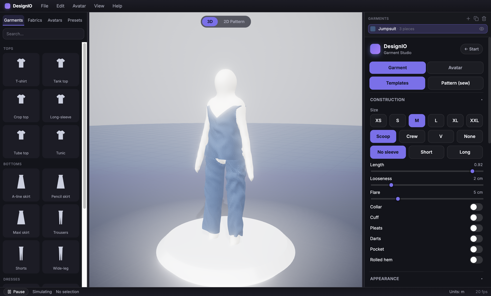 | 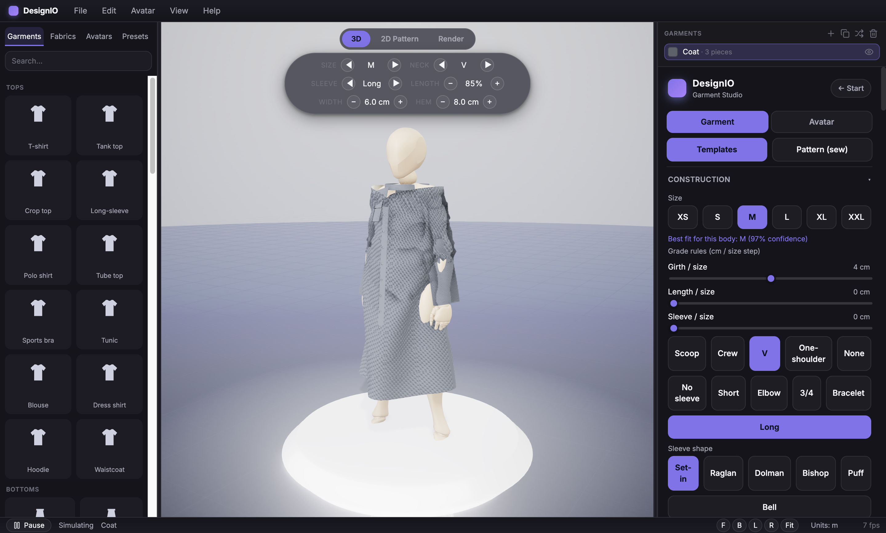 |

---

## Construction detail

Beyond the silhouette, add real **construction detail** — each shows up **both** on the 3D garment and in
the flat pattern (the panels reshape, the pattern notes the detail), and each garment only offers the
details it actually supports:

- **Collar** (raises/closes the neckline into a stand) with a **collar-style** picker, fitted **cuffs**,
  **pleats** (knife · box · accordion · cartridge · gather · **shirring** — fine elastic gathers ·
  **smocking** — a honeycomb diamond lattice) for a fuller, swishier hem, **darts** (a
  nipped, tailored waist), **patch pockets** (chest on tops, hips on skirts/trousers — topstitched in 3D,
  a pocket panel on the pattern), and a **rolled hem**.
- A **front closure** on front-opening pieces (blouse · blazer · coat · hoodie …) — a centre-front placket
  with a **button column** or a **zip + metal pull** (the hoodie zips).
- Deeper tailoring flags — **lined · interfaced · waistband · facing · drawstring · ruffles · boning ·
  ribbing · yoke · princess seams**.

Every garment is also **topstitched**: drape-following dashed contrast stitch lines trace the hems,
necklines, waistbands and cuffs in 3D (a lighter thread on dark cloth, darker on light — the classic
visible topstitch, or the trim colour when contrast trim is on), and the 2D flat pattern draws a matching
gold topstitch guide inset from each panel's sew line.

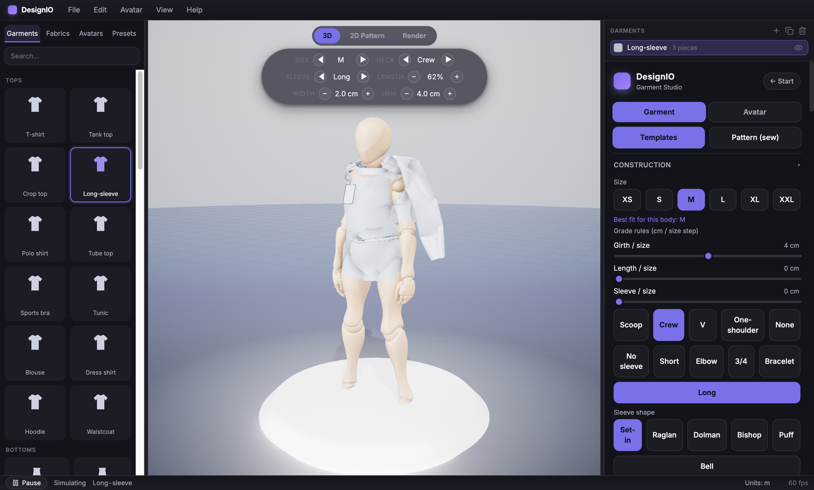

---

## The fabric library — 24 fabrics

Every fabric carries **physical** properties (weight, stretch, bendiness, friction) that drive the
**drape**, and **visual** properties (weave, sheen, anisotropy, sheerness, roughness) that drive the
**material** — so the *same garment drapes differently* on stiff denim vs fluid chiffon. Weight also drives
**fabric thickness**: every garment carries an inner lining shell (pushed inward along the surface normal
by the fabric's real thickness), so hems, necklines and openings read solid instead of paper-thin — a heavy
wool coat sits visibly thicker than a light poplin.

- **Wovens** (9) — poplin, oxford, chino twill, denim, canvas, corduroy, linen, wool flannel, tweed
- **Silks & smooth** (5) — charmeuse, satin, crepe, organza, chiffon
- **Knits** (5) — jersey, rib, French terry, fleece, cable knit
- **Specialty** (5) — leather, suede, velvet, tulle, spandex

| A velvet dress — each fabric drives look **and** drape | Macro close-up of satin — procedural weave + sheen |
| --- | --- |
| 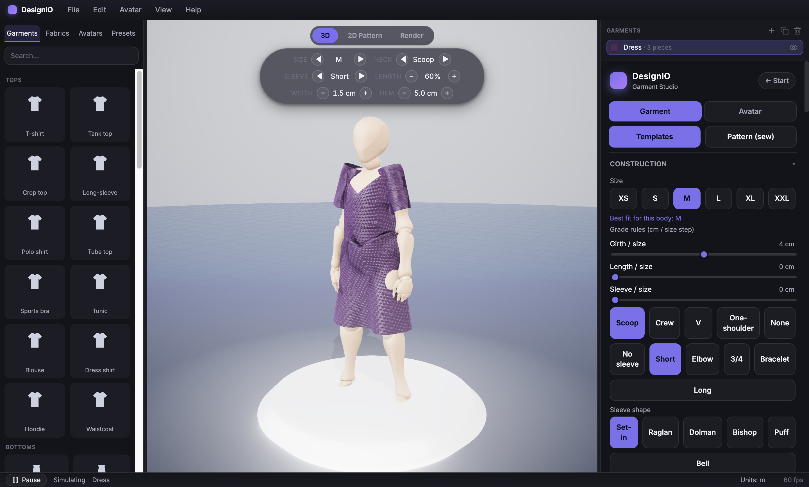 | 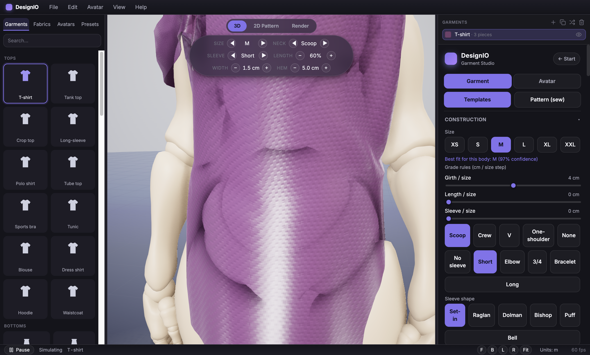 |

Live-inspect any fabric (GSM, stretch, drape, grip, roughness, sheen, weave density/depth, anisotropy,
sheerness), and macro-zoom to see the woven micro-surface. Pick a colour and DesignIO snaps it to the
nearest **named production reference** (`TR-####`), shown in the panel and carried into the tech-pack.

---

## Surface design & fabric finishes

Go far past a flat colour — layer a **surface finish** onto any garment, all baked into the material so
they simulate and export with it:

| Textile patterns | Ombré / dip-dye | Distressed / washed |
| --- | --- | --- |
| 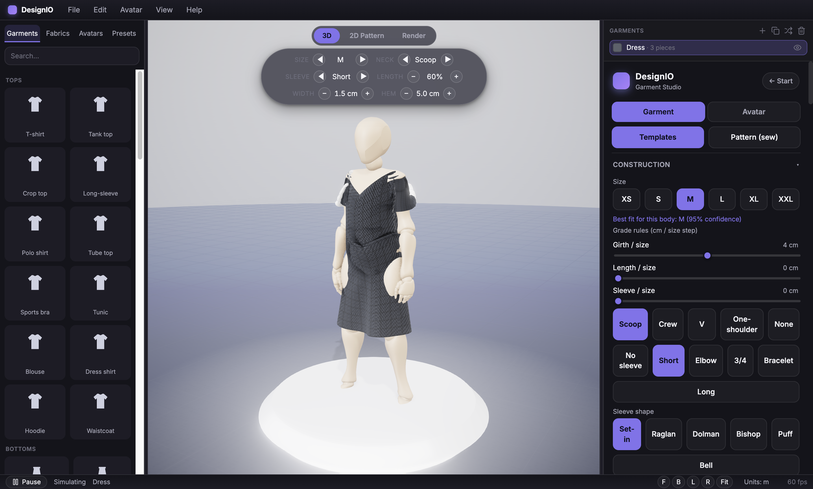 | 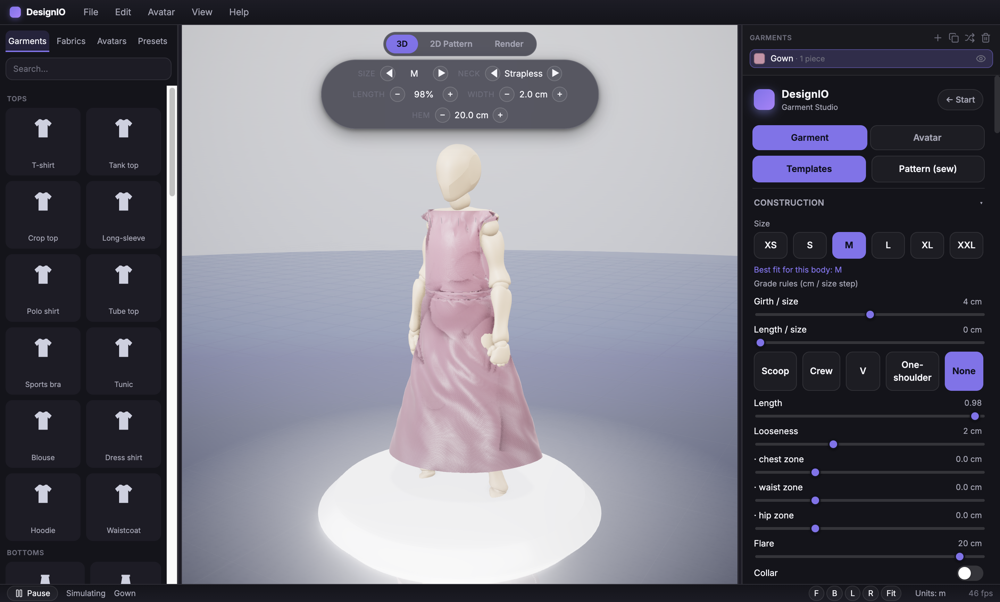 | 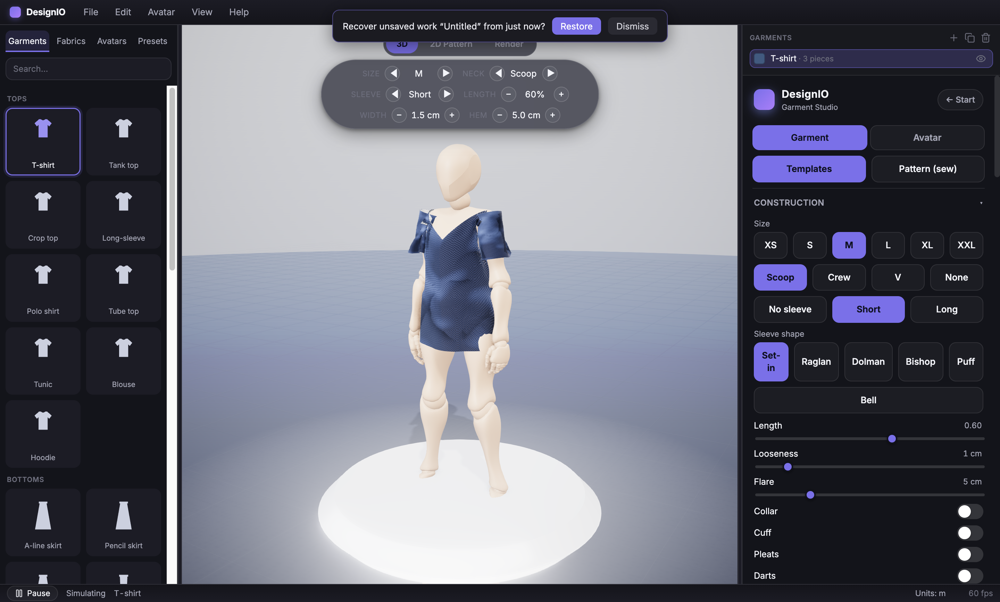 |
| stripe · plaid · check · gingham · polka · camo | top-down · bottom-up · radial | faded · acid-wash · distressed |

| Sequins / beading / foil | Iridescent / holographic | Sheer lace / broderie |
| --- | --- | --- |
| 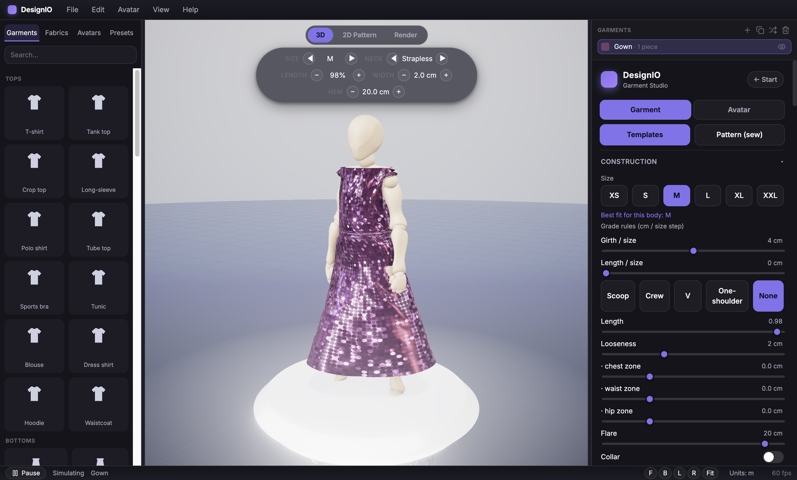 | 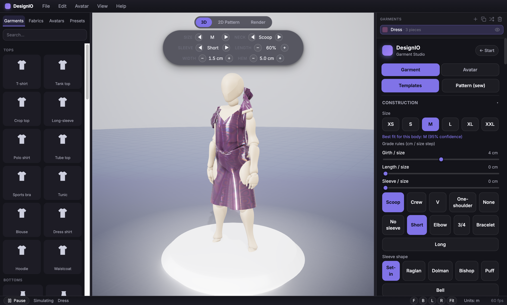 |  |
| glittering eveningwear finishes | colour-shifting thin-film | chantilly · geometric · fishnet (real see-through cutout) |

| Quilting | Faux-fur / shearling / fleece | Wet look |
| --- | --- | --- |
| 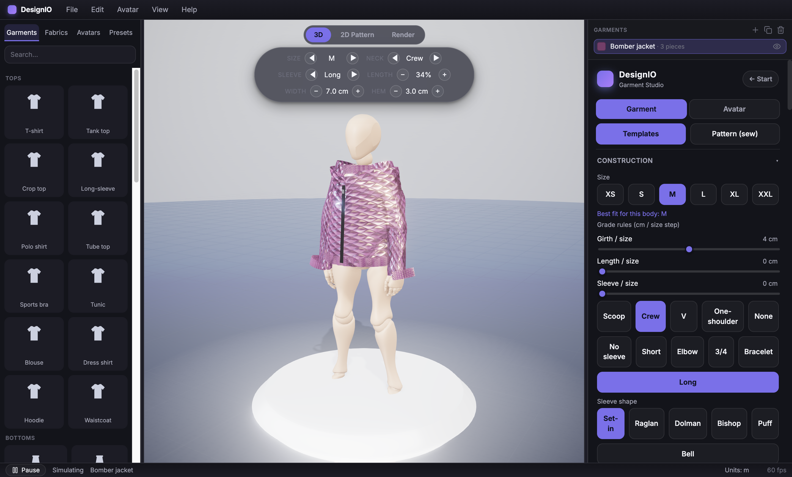 | 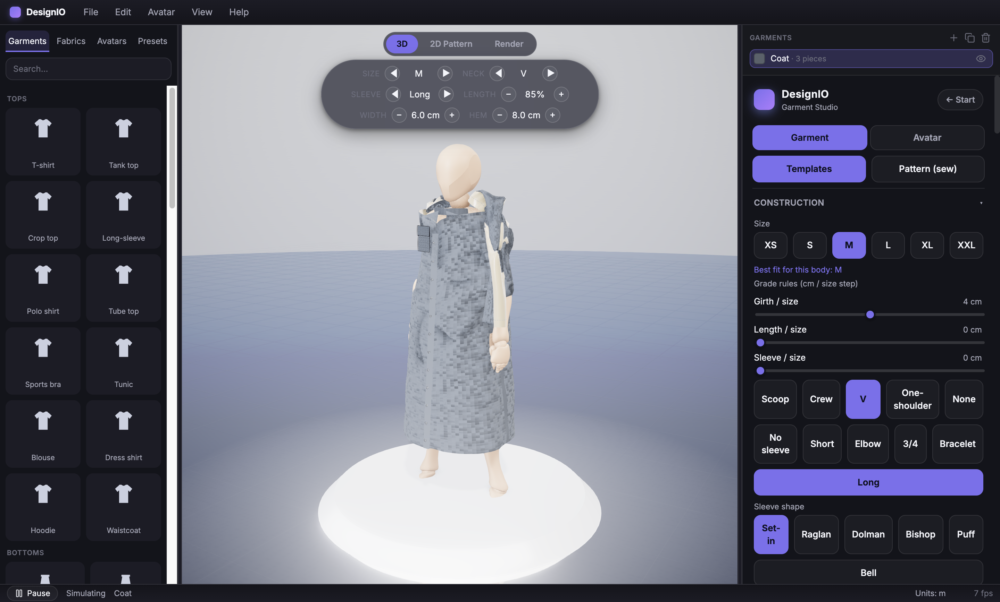 | 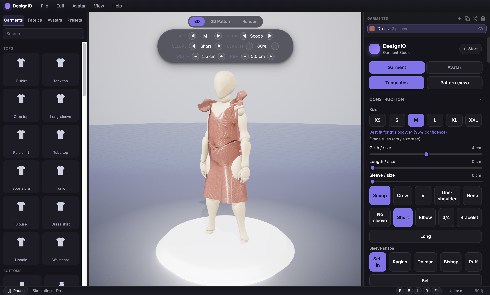 |
| channel · diamond · box pillow-loft | directional fuzzy pile, no extra geometry | waterlogged: darker + glossy, clings limp |

The **iridescent** finish flows a real oil-on-water swirl across the surface (a procedural thin-film
thickness map), not a flat colour shift. The **Wet look** toggle (in the Appearance panel) makes the fabric
heavier + limp + clinging *and* darker + glossy — a rain / swim / beach preview.

You can also **import a fabric photo** and DesignIO bakes it into a **seamless tiling PBR material** (albedo
+ derived normal + roughness) that clothes the whole garment. Every fabric renders with a **procedural
weave** (a paired normal **and** roughness map so yarn crowns catch the light and valleys stay matte),
per-family **cloth sheen**, and a warp-aligned **anisotropic** highlight — so satins streak and wovens read
matte, not plastic.

---

## Per-part & per-panel fabric

Real garments aren't one material. Pick a **part** — **Body · Sleeves · Legs** — or a **panel** — **front
vs back** on the body and each leg — and give it its own **fabric and colour** (leather sleeves on a
polyester body, a jersey dress with a **leather back**, denim legs with a contrast back panel…). Each
part's fabric even drives its **physics**, not just its look — **leather drapes stiffer than jersey**, so a
leather back hangs crisper than the fluid front. Add a **contrast trim** on the collar / cuffs / pockets /
hem, and set the **seam allowance** + **notches** for production.

| 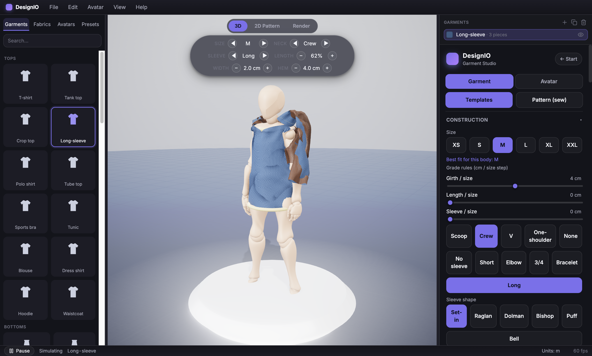 | 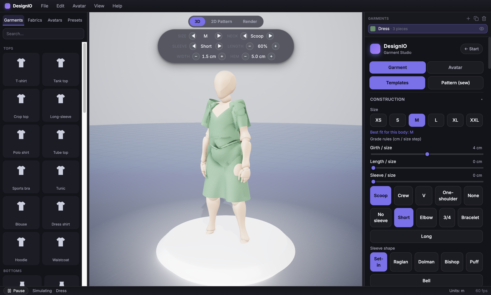 |
| --- | --- |
| *Per-part fabric — leather sleeves, denim body, contrast trim.* | *Per-panel fabric — a jersey front, a leather back.* |

---

## Prints, logos & text

Import **several logos/graphics** (PNG/JPG/WebP) and **text**, and place **each one exactly** — its own
**position, size and rotation** — via the studio's **Prints** manager. Add a chest logo, a slogan, a sleeve
badge… each print is independent and updates live while the cloth simulates. Prints follow the garment — a
logo dragged onto the **back** shows on the back panel even when that panel wears its own fabric — and each
sits on its own **part** (body / sleeves / legs) with a **style**: flat, raised **embroidery**, or an
**appliqué** patch.

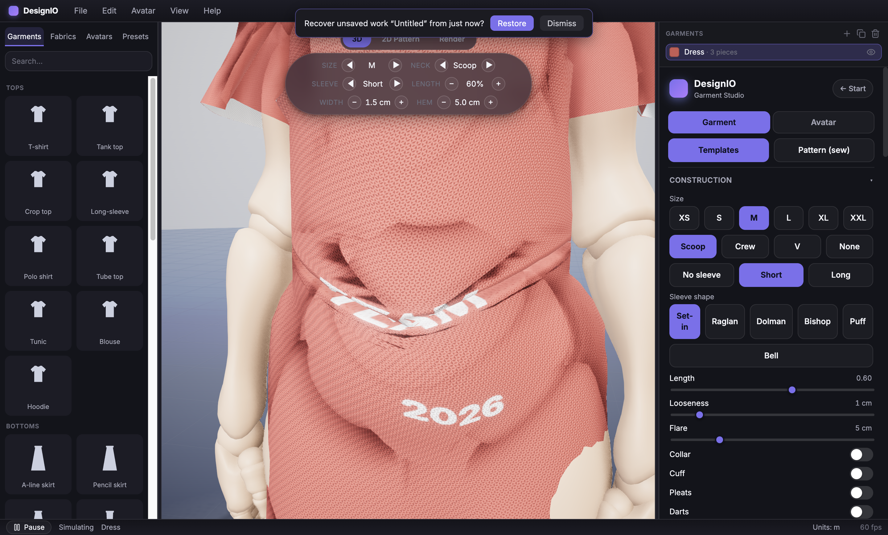

---

## The avatar — full customization

**The default body is an imported GLB avatar.** Drop a CC0 photoreal human into
`src/renderer/assets/mannequin.glb` and it renders with **its own skin** (a bare rig is painted with the
studio mannequin material), standing arms-down from its idle pose. It **falls back** to a procedural
metaball body sculpted like a real dress form — **defined shoulders, bust/chest, nipped waist, hips,
tapered limbs with knees, and shaped head / hands / feet** — if it can't load, or flip *Imported body (GLB)*
off to sculpt on that instead. Either way the capsule skeleton stays the cloth collider, so garments drape
correctly.

| Female model | Male model | Imported GLB body (default) |
| --- | --- | --- |
| 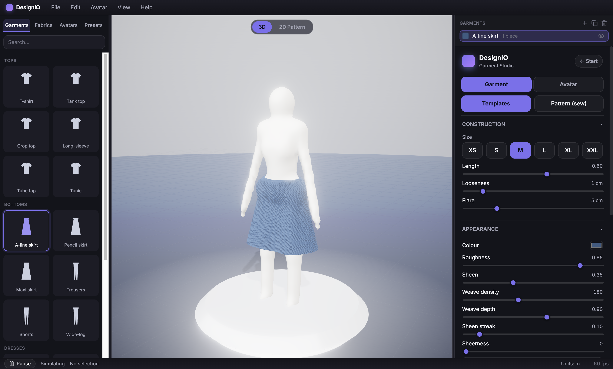 | 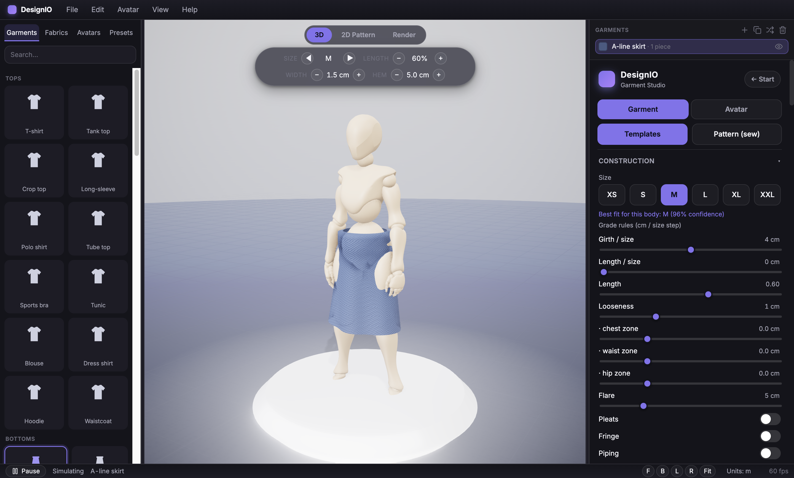 | 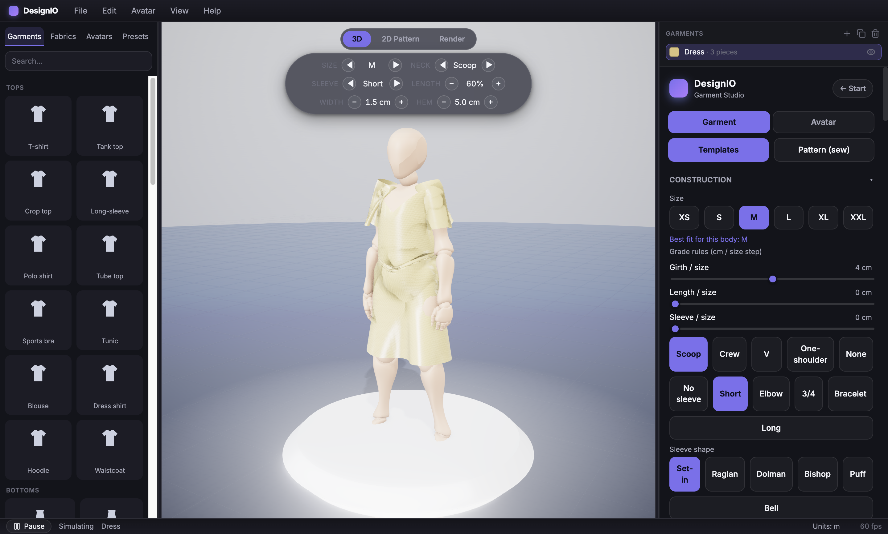 |

Then **make it yours**:

- **Body shaping** — height, overall build, and independent **bust / waist / hips**, plus **body-shape
  presets** (Runway · Curvy · Plus · Athletic · Petite · Tall). A **made-to-measure** map converts real cm
  ↔ the body params, and a **size-chart importer** applies a whole row at once.
- **Skin** — a **complexion picker** of 8 tones (fair → deep) × warm / neutral / cool **undertones**, on a
  warm subsurface-sheen skin material.
- **Hair & face** — hairstyles (short · bob · long · afro) with a **hair colour**, plus subtle toggleable
  **face features** (brows / eyes / lips) that ride the live head.

| Body preset (curvy) | Skin tone + undertone | Hair & face |
| --- | --- | --- |
|  | 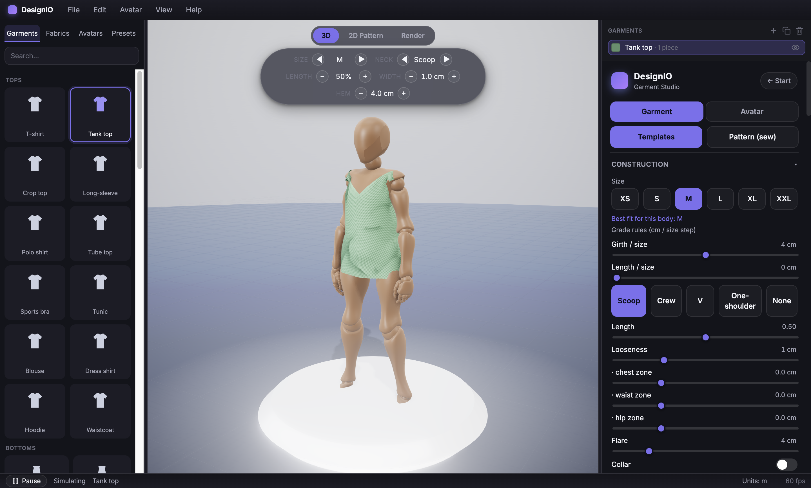 | 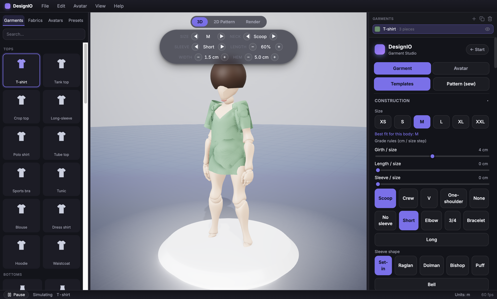 |

---

## Accessories, headwear & neckwear

Dress the avatar beyond the garment. **Rigid accessories** ride the live (and animated) body — **shoes ·
belt · hat · bag**, plus a full set of **headwear & neckwear**: **beanie · cap · bucket hat · balaclava
(ski mask) · scarf · neck gaiter**, each placed by the head/neck frame so it turns and nods with the head.

| Accessories (hat · belt · bag · shoes) | Headwear & neckwear (beanie · scarf) | Balaclava (ski mask) |
| --- | --- | --- |
| 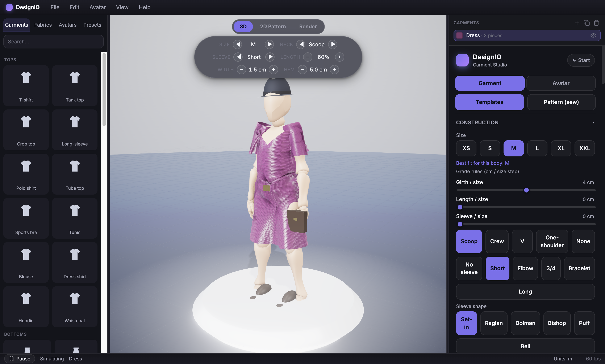 | 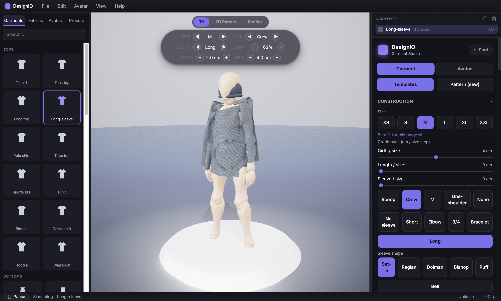 | 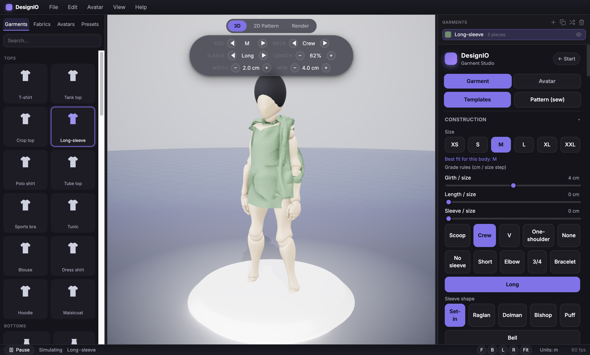 |

And three of them are **real cloth-sim catalog garments** that drape with physics — a **snood** (cowl), a
knit **beanie** that hugs the crown, and a **scarf** wrapped once around the neck with hanging tails.

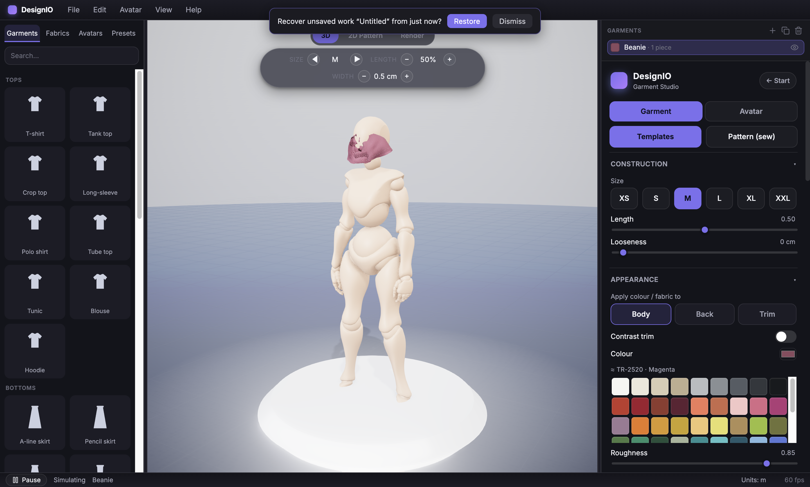

---

## Real 3D cloth simulation

Each garment **simulates** with an **XPBD** cloth solver and collides against the **true body surface** (a
BVH over the mannequin mesh) plus skeleton capsules — so it hugs the real silhouette, sleeves sit on the
arms, and skirts flare naturally. Cloth also collides with **itself and other garments** (a global
spatial-hash pass), so a flared skirt doesn't pass through itself and a **layered outfit pushes off** rather
than interpenetrating.

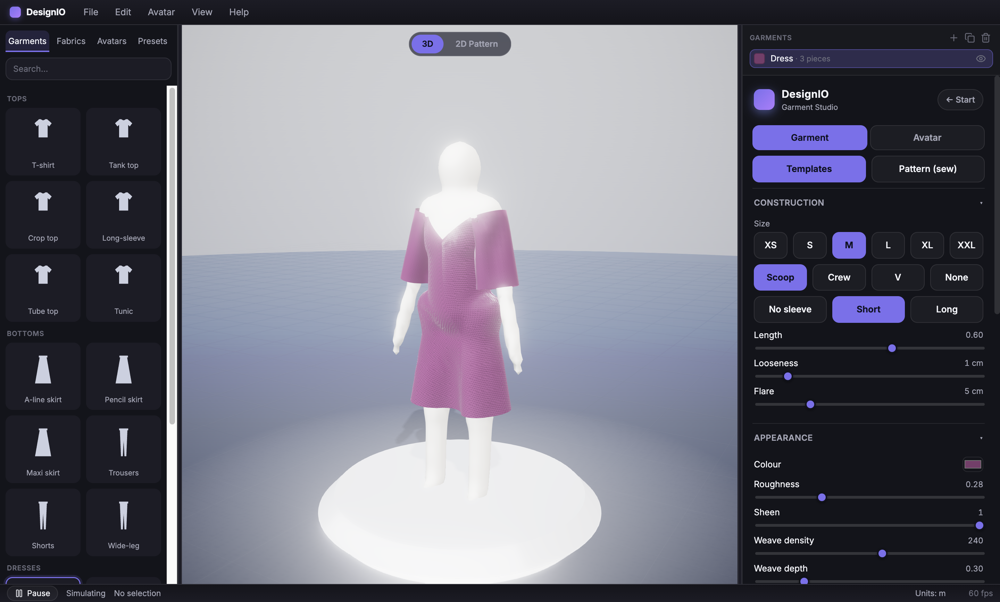

Under the hood: **adaptive remeshing** packs solver rings where the silhouette bends (waist cinch, flare
onset, puff-sleeve bell) at no extra particle cost; per-fabric **aerodynamic drag** gives real secondary
motion; contact is **inelastic**, so cloth settles onto the body instead of springing off; and both solvers
**sleep** to a dead stop when there's no wind and the body is still — so at default settings a garment hangs
**perfectly still**, no drift or jitter, and any wind / body-move / edit wakes it.

**Trapped-air loft** turns a garment into a real **puffer** — a quilted coat (or any garment with the
**Puffer loft** toggle) inflates off the body with an outward pressure that the stretch constraints cap, so
it stands proud instead of hanging flat.

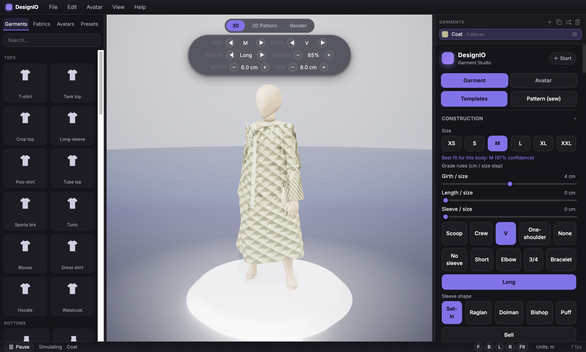

---

## The 2D flat pattern — both ways

Flip the central viewport to **2D Pattern** and you get the **actual flat pattern of the garment you
designed** — the front/back bodice unwrapped with its **real neckline curve, armhole and side seams**,
A-line skirt/dress panels, tapered trouser legs, and a shaped sleeve, each with **seam allowance, grainline
and notches**. It's derived from the exact 3D construction, so 2D and 3D always agree.

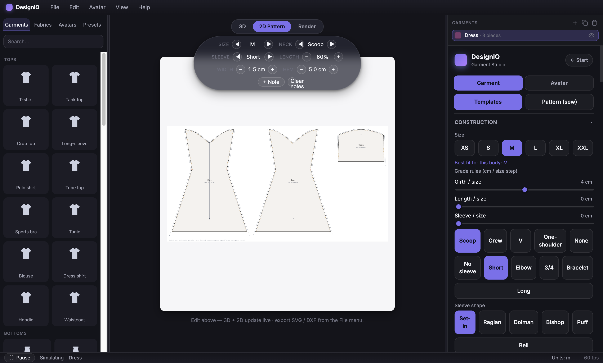

**2D and 3D are one design — edit either way.** The quick-edit toolbar floats over **both** views (size ·
neckline · sleeve · length · width · hem), driving the same garment, so you can design entirely in 2D *or*
3D and the other updates live. You can **import a flat pattern** (DXF, round-tripping the export) back into
the 2D pane, or work in **Pattern (sew)** mode — adjust FRONT/BACK panels and *Sew & simulate* to wrap them
onto the body.

---

## Layering, projects & files

Dress the mannequin in a **whole outfit** — add as many garments as you like (a top *and* a skirt *and* a
jacket…), each with its own fabric, colour and print, all simulating together on one body and **colliding
with each other** so the layers sit apart. The **Object Browser** lists every garment: **select** one to
edit it, toggle **visibility**, and **add / duplicate / delete**. Full **cut / copy / paste** (⌘X/C/V),
**duplicate** (⌘D) and **undo / redo** (⌘Z / ⇧⌘Z).

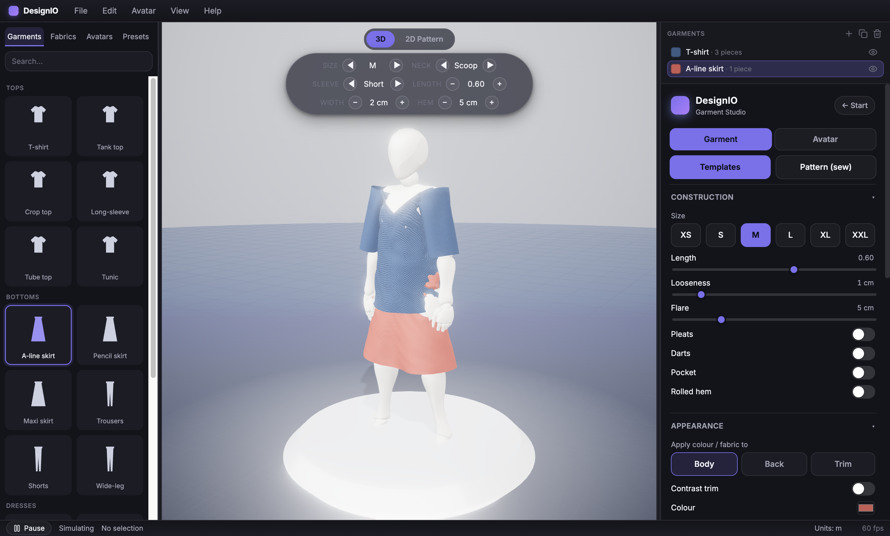

Every design you save lands on a **Projects** page (with a thumbnail) — reopen in one click, **rename** or
**delete**, and **import / export `.dio`** files to move work between machines. An **autosave + crash
recovery** system snapshots your working document every 15 s and offers to restore it after an unexpected
close. **Colorways** save appearance-only colour/fabric variants of one design.

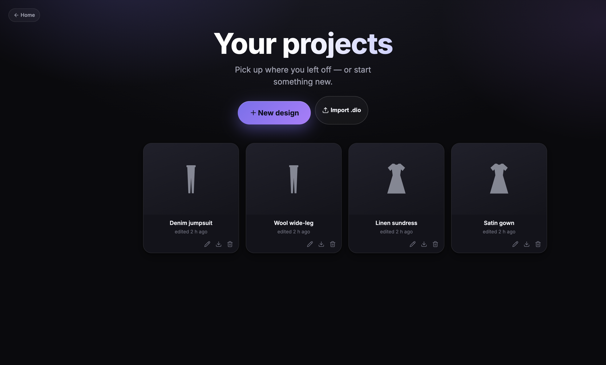

---

## Studio lighting & backdrops

Light the shot like a photographer. Pick a **studio lighting preset** — **Studio · Softbox · Dramatic ·
High-key · Runway · Golden-hour** (each an azimuth/elevation-described key + rims + hemi + exposure) — and a
**backdrop**: Studio grey · White · Product-white (flat, no floor) · Charcoal · Black (floating shot) ·
Blush · Sky cyclorama, or **Transparent** (the Render tab then exports a PNG **with alpha**). Every backdrop
gradient is dithered so it never bands behind the figure. Pick the **tone-mapping** operator too — **ACES ·
AgX · Neutral · Filmic · Reinhard** — to roll bright highlights (white satin, sequins, bloom) off with more
or less saturation.

| Dramatic lighting | Runway lighting | Blush backdrop |
| --- | --- | --- |
| 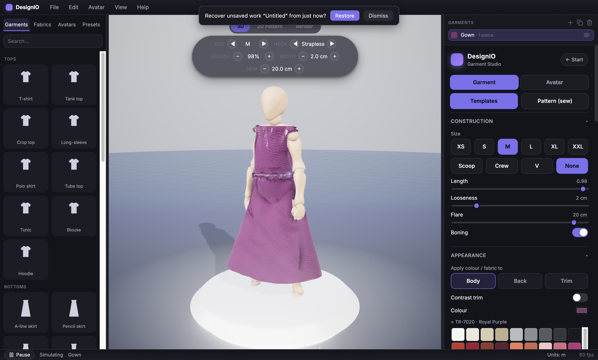 | 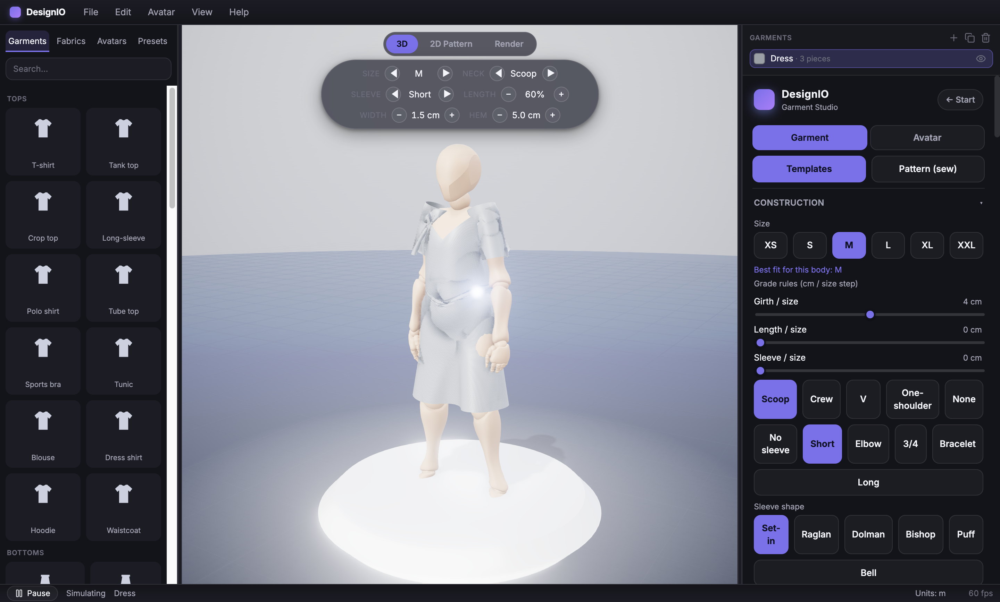 | 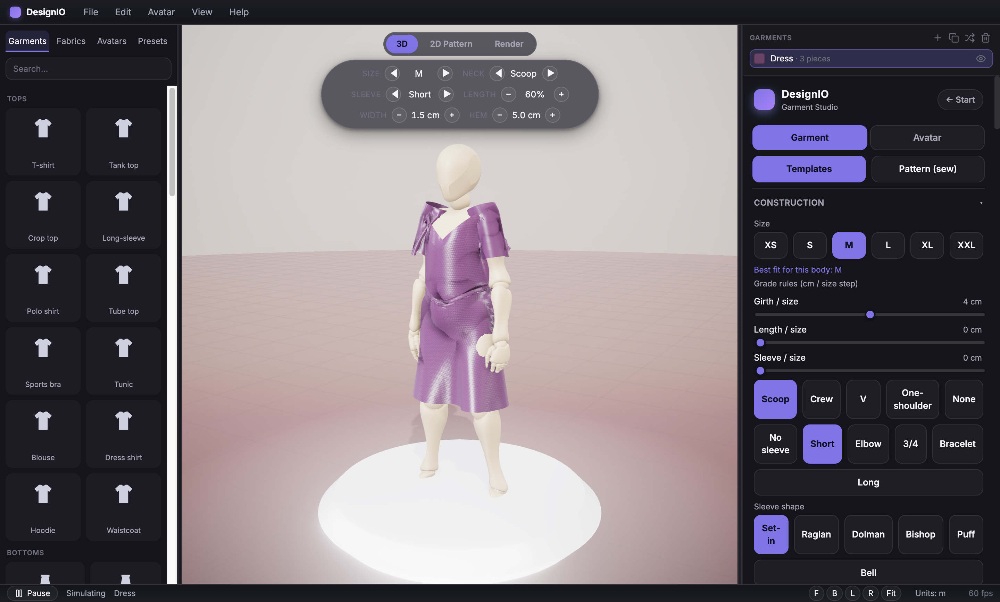 |

---

## Analysis & fit tools

See how a garment actually fits:

- **Fit / tension heatmap** — a slack → blue → tight → red ramp baked into the mesh, so you can see exactly
  where a garment pulls.
- **Fit-failure (stress) view** — fabric-aware colouring that reds out sooner on a stiff woven than a
  stretchy knit.
- **Pressure / contact fit map** — a cold→hot ramp of where the garment actually **presses into the
  body** (from the solver's real collision push-out): a hanging skirt reads blue, a snug bodice bearing
  on the bust and waist reads yellow→red — real contact-force fit analysis, distinct from strain.
- **Strain-driven micro-wrinkles** — a shader crease perturbation that nucleates real wrinkles where the
  cloth is under strain.
- **Measure & annotate** — a tape-measure (click two points → a cm reading) and pinned notes, reprojected
  onto the live 3D each frame.

| Fit / tension heatmap | Pressure / contact fit map | Strain-driven micro-wrinkles |
| --- | --- | --- |
| 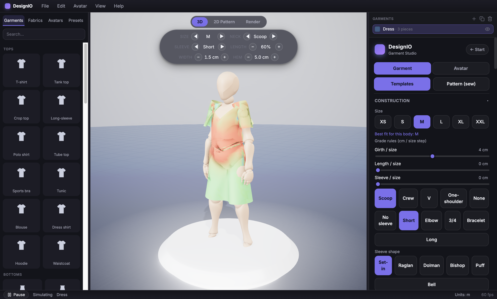 | 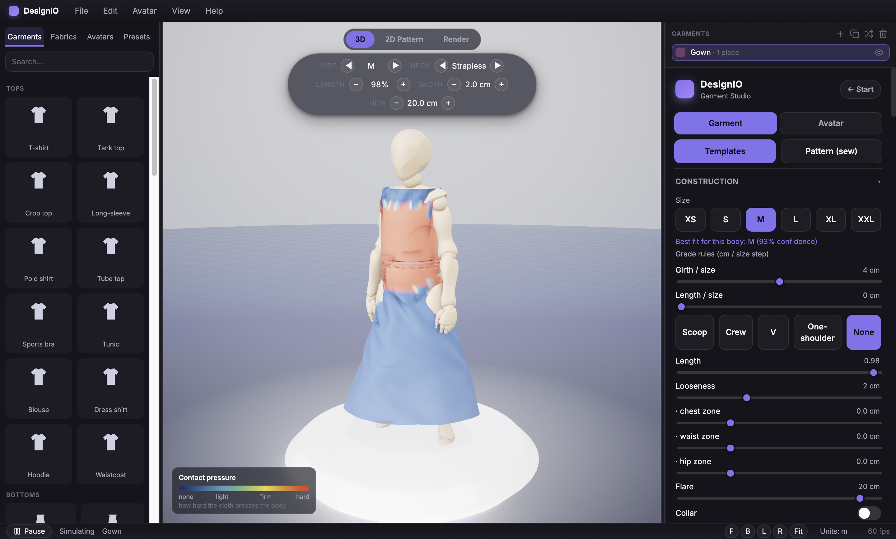 | 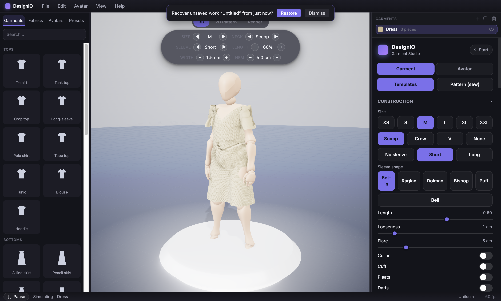 |

---

## Motion, poses & shots

At default settings the garment **hangs perfectly still** (the solver sleeps when windless and the body is
still). Then bring it to life:

- **Animate** — set the mannequin to **idle / walk** and the imported avatar **moves on the spot** with the
  clothes **staying on and moving with it**: garments pin to the body's shoulders / hips (not fixed space),
  so a dress swishes and a skirt sways, and the cloth colliders track the rig's bones over the moving arms
  and legs. Idle↔walk transitions **crossfade** smoothly.
- **Per-fabric secondary motion (4D)** — aerodynamic drag makes a light, sheer **chiffon billow, float and
  lag** while a heavy **denim** follows **near-rigid**.
- **Wind presets** — still · breeze · gust · runway, with a pulsing gust.
- **Lookbook poses** — freeze a real idle/walk frame or a procedural stance (stand · weight-shift · stride ·
  relaxed); garments re-settle onto the pose.
- **Turntable** — one-click orbit → **WebM**.
- **Shot sequencer** — a keyframe **timeline** for camera + avatar subject, eased and recorded to WebM.
- **Runway line-up** — a collection shot of the garment across N colourways, composited into one PNG.
- **Batch render** — one crisp PNG per saved colourway, bundled into a single **ZIP** (a ready-to-drop
  lookbook set).

| The avatar mid-stride, its dress moving with the walk | Chiffon caught in runway wind | A supersampled Render-tab still |
| --- | --- | --- |
| 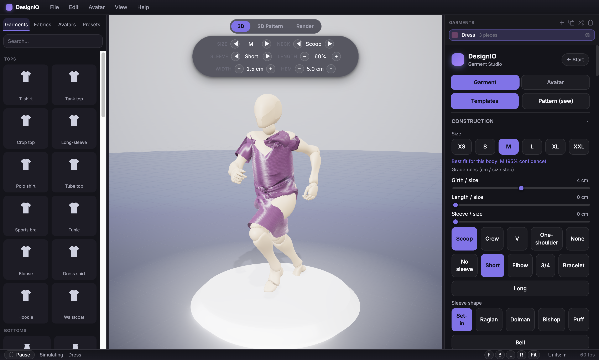 | 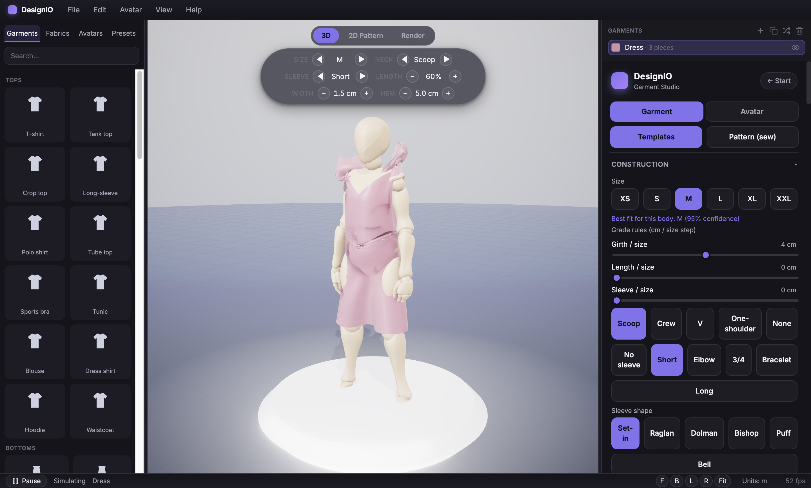 | 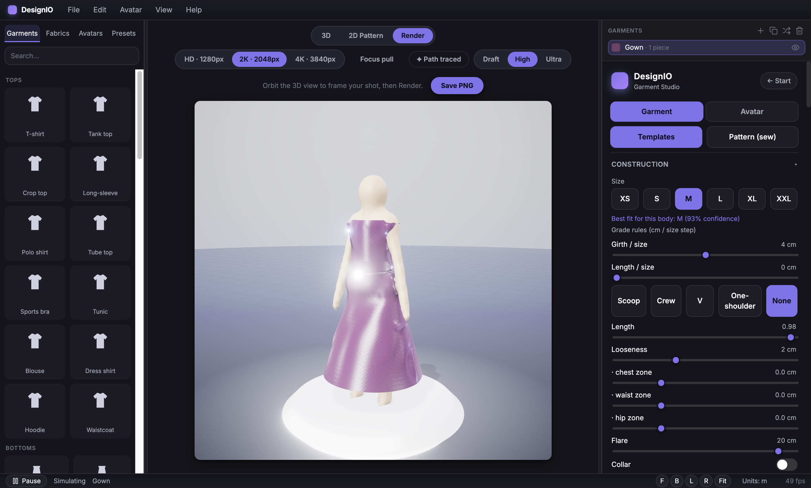 |

*(The viewport renders adaptively — full frame rate while anything moves or you interact, and a light idle
heartbeat when the scene is settled, so it stays smooth and light.)*

---

## Sizing, measurements & the manufacturing pack

Pick a **size** (XS – XXL) and the garment **grades** to fit; the **Measurements** panel shows the real
production spec **live** — chest, waist, hip, length, sleeve, inseam, hem sweep, plus estimated **fabric
area** and **total seam length** (toggle **cm / in**). All of it is derived from the exact same construction
as the 3D garment and the flat pattern, so it always agrees. Graded **points-of-measure** span the whole
size run, and an auto **care label** derives fibre content % + laundering lines from the fabric.

When you're ready, **Export for manufacturing** — one printable pack (HTML + JSON) with, per garment, a
**spec sheet**, a **fabric BOM** (fabric · weight · yardage), **care & content**, a nested **marker**
(realistic fabric yield + efficiency), and the **embedded flat pattern** — everything a maker needs to cut
and sew it.

---

## Export everything

| Format | What |
| --- | --- |
| **glTF · OBJ** | the simulated 3D garment |
| **USDZ** | iOS **AR Quick Look** |
| **SVG · DXF** | the real per-garment flat pattern (with placed prints mapped to scale); DXF round-trips back in |
| **Tech-pack (HTML + JSON)** | live measurement spec |
| **Manufacturing pack (HTML + JSON)** | spec sheet + fabric BOM + care & content + marker + embedded patterns |
| **PNG** | supersampled Render-tab stills (HD / 2K / 4K, optional alpha) |
| **WebM** | turntable spins + timeline clips |
| **ZIP** | batch render — one PNG per colourway (a lookbook set) |
| **`.dio`** | the full editable project |

---

## Run it

> Running this project requires the author's permission — see **[License & usage](#️-license--usage--all-rights-reserved)** above.

**Requirements:** Node.js 18+ (developed on Node 20/22) and npm.

```bash
npm install
npm run dev        # launch the DesignIO desktop app (Vite hot reload)
```

### Other commands

```bash
npm run build      # bundle main / preload / renderer into ./out
npm run preview    # build, then run the packaged bundle
npm test           # headless solver / geometry / catalog tests (vitest)
npm run typecheck  # strict TypeScript, no emit
npm run capture    # re-render every README screenshot from the current build
```

---

## How to ship it

DesignIO is bundled by **electron-vite**. A production build compiles the three Electron layers — **main**,
**preload** and **renderer** — into `./out`:

```bash
npm run build      # → ./out/{main,preload,renderer}
npm run preview    # run that production bundle locally (final smoke-test before shipping)
```

**Quality gate (run before every ship):**

```bash
npm run typecheck && npm test && npm run build
```

CI runs exactly this on **Node 20 and 22** (`.github/workflows/ci.yml`) and must be green.

**Packaging into an installer** (`.dmg` / `.exe` / `.AppImage`) is **not yet configured** — DesignIO is a
work-in-progress and currently ships as the `./out` bundle run through Electron. Adding a distributable is a
matter of wiring **electron-builder** (or electron-forge) to package `./out`; the app is structured for it
(single main entry, context-isolated preload, static renderer), but that step is intentionally left for a
release milestone. Until then, `npm run preview` is the way to run the built app.

---

## How it's built

```
src/
  main/         Electron main process (window, native menu, CSP, save/open dialogs)
  preload/      context-isolated bridge
  renderer/
    core/       Viewport (scene/camera/controls + GTAO/bloom/SMAA post, adaptive render) · Environment
                (studio IBL, lighting & backdrop presets, floor, shadow-catcher) · Loop · coalesce
    avatar/     Mannequin (poseable/resizable female+male capsule body) · BodyMesh (metaball) · GlbMannequin
                (default realistic avatar) · skin · measure · poses · bodyPresets · accessories · face · colliders
    cloth/      XPBDSolver · ClothCollision (self/inter) · ClothWorld (sewn panels) · Garment · adaptiveMesh
                · FabricMaterial · fabricPresets · windPresets · simQuality
    fabric/     FabricLibrary (24 fabrics) · weaveTexture · textile · ombre · wear · swatch · sparkle
                · iridescent · quilt · lace · fur · namedColors · heatmap · wrinkle
    garments/   schema (GarmentDefinition) · registry (the 31-garment catalog, as data) · factory · decor
    garment/    GarmentController (one garment's multi-piece sim, body-anchored) · templates
    studio/     GarmentStack (the live layer stack) · document (.dio, undo, colorways) · projectStore
                · autosave · timeline + TimelinePlayer · turntable · measure + MeasureTool · lineup
    pattern/    2D panels → sew → drape
    export/     exporters3d (glTF/OBJ/USDZ) · garmentPattern (SVG/DXF) · garmentMetrics · careLabel
                · manufacture · marker · patternImport · techpack
    start/      Homepage · ProjectsPage · StartPage ("design your piece") · PreviewStudio · design · presets
    shell/      professional studio shell — StudioShell · menuBar · statusBar · library · objectBrowser · centerTabs
    ui/         Property Editor (context-sensitive panel) · controls · thumbnails · toast · design tokens + styles
tests/          headless solver / geometry / garment-catalog / fabric / export correctness (vitest)
```

**Cloth model:** an XPBD (Extended Position-Based Dynamics) mass-spring solver — structural, shear and
bending distance constraints, integrated under gravity/wind in fixed substeps, with mesh-BVH body collision
+ capsule broadphase + friction + global particle self/inter-collision. Real-time, not offline
finite-element — tuned for 60 fps, and it sleeps at rest.

**Data-driven catalog:** a garment is a `GarmentDefinition` (category + composable pieces + which
construction controls it supports). A factory turns it into simulated cloth. **Adding a garment, a fabric,
or a supported detail is a data change, not new code.**

---

## Roadmap

**Shipped:** data-driven garment schema + factory · 31-garment catalog (tops · bottoms · dresses ·
one-piece · outerwear · **cloth-sim headwear/neckwear**) with a category picker + schema-driven construction
UI · 24-fabric library by family · **fabric thickness** (two-sided garments with a lining shell) · full
**construction detail** (collar/cuff/pleats/darts/pockets/hem/closure + lining/interfacing/waistband/…) +
drape-following **topstitch** · **surface finishes** (textiles · ombré · distressing · sequins · iridescence
· quilting · lace · faux-fur · photo→PBR swatch) · **per-part physics** (leather drapes stiffer than jersey)
· **per-panel fabric** (front vs back) · **prints on any panel** (flat / embroidery / appliqué) · imported
**GLB avatar as the default body** · female/male shaping + **body presets** · **skin tones · hair · face ·
lookbook poses** · **accessories, headwear & neckwear** · mesh-accurate **BVH body collision** + **cloth
self/inter-collision** · **body-pinned garments** — the avatar **walks in place with its clothes on** ·
**4D per-fabric secondary motion** · **trapped-air puffer loft** · **wet-look finish** · **PBR surface
realism** (procedural weave roughness + per-family sheen + warp-aligned anisotropy + angle-weighted normals)
· **lighting & backdrop presets** + **selectable tone-mapping** (ACES/AgX/Neutral/Filmic/Reinhard) · **fit
heatmap / stress / pressure map / wrinkles** ·
**measure & annotate** · **timeline shot-sequencer · turntable · runway line-up · batch render (ZIP)** ·
**adaptive rendering** · autosave + crash recovery · an **onboarding tour** ·
glTF/OBJ/**USDZ**/SVG/DXF/tech-pack/manufacturing-pack export · a
production-grade, consistent UI.

**Planned (in phases):** **tailored outerwear** (lapels, structured coats) · more garments and fabrics ·
distributable installers (electron-builder) · export & fidelity polish.

---

*DesignIO © 2026 Zayan Khan — all rights reserved. Ask before using: khanzayan_123@hotmail.com*
