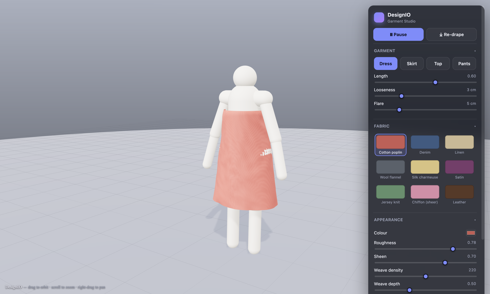

# DesignIO

A personal, fully-3D clothing design tool — in the spirit of [CLO3D](https://www.clo3d.com/en/) and
[Browzwear](https://browzwear.com/) — for designing your own clothes realistically and virtually.
Built as a desktop app (Electron + Three.js + TypeScript).

> **Status: Working build.** Design garments (templates or sewn from 2D patterns) on a **smooth human
> mannequin**, dress them in real fabrics with live cloth physics, animate the body, and export the
> result — all in a studio scene.



*Live capture: a fitted dress simulated on the smooth (metaball) mannequin in the studio.*


*Macro close-up of satin — procedural weave normal map + sheen + anisotropic highlights.*

## What you can do right now

- **Start on the "Design your piece" page**: pick a garment (dress / skirt / top / pants), colour it,
  **add your own graphic + text**, and set the fit — with a **live 3D preview** (the garment draped on
  the mannequin, auto-rotating). Then hit **Design in 3D →** to open it in the full studio.
- Orbit / zoom / pan around a **smooth human mannequin** (a continuous body, built procedurally with
  metaballs) in a **bright reflective studio** (post-processed: subtle bloom, crisp SMAA, mirror floor).
- Pick a **garment template** — **dress, skirt, top, or pants** — and tweak its **length, looseness,
  and flare**; it rebuilds and re-drapes on the body (pants simulate as two legs).
- Give tops & dresses a real **neckline** (scoop / crew / V / strapless) with shoulder coverage,
  **sleeves** (short / long, draped on the arms), and dresses a **cinched waist** + flared skirt —
  constructed garments, not strapless tubes.
- Each garment **drapes with real folds** — an XPBD cloth solver with body-capsule collision +
  friction, anchored so it stays on.
- **Pattern mode** (the CLO3D loop): adjust flat **FRONT/BACK panels** (bust, length) and
  **Sew & simulate** — the two panels stitch at the side seams and wrap the body into a 3D garment.
- **Export the design to get it made**: **3D** (glTF/OBJ), **2D pattern** (SVG/DXF for a cutter),
  and a **measurement tech-pack** (printable HTML + JSON) — saved via a native file dialog.
- Design on a **clean matte studio mannequin** (a smooth procedural body — tapered torso, hands, feet),
  or toggle **Imported body (GLB)** to drop in your own CC0/MakeHuman export (see
  [THIRD_PARTY.md](THIRD_PARTY.md)). **Resize the mannequin** (height & build) — the garment refits.
- **Animate** the mannequin — **idle / walk / turntable** — and watch the garment move with the body
  ("4D"): a swinging skirt, a flowing dress, moving pant legs.
- Choose from a **fabric library** (cotton poplin, denim, linen, wool flannel, silk charmeuse, satin,
  jersey knit, sheer chiffon, leather) — each with real properties that drive **both look and drape**.
- **Live-inspect a fabric**: weight (GSM), stretch, drape, grip, colour, roughness, sheen, weave
  density/depth, sheen streak (anisotropy), and sheerness — heavier/stiffer fabrics hang differently.
- **Macro close-up** to inspect the woven micro-surface; tweak **gravity/wind** (lighter fabrics
  flutter more), **exposure**, and **Drape/Reset**.

## Requirements

- Node.js 18+ (developed on Node 25) and npm.

## Run it

```bash
npm install
npm run dev        # launches the DesignIO desktop app with hot reload
```

The app window opens automatically. Use the **Fabric Studio** panel (top-right): click a fabric in the
gallery, tweak its look and drape with the labelled sliders, and drag in the viewport to orbit.

### Other commands

```bash
npm run build      # bundle main / preload / renderer into ./out (production build)
npm run preview    # build, then run the packaged app
npm test           # run the cloth-solver unit + integration tests (vitest)
npm run typecheck  # strict TypeScript check, no emit
```

## How it's built

```
src/
  main/         Electron main process (window, lifecycle)
  preload/      context-isolated bridge
  renderer/
    core/       Viewport (scene/camera/controls), Environment (studio IBL + shadows), Loop (fixed-dt)
    avatar/     Mannequin (procedural capsule human) + colliders (capsule closest-point)
    cloth/      XPBDSolver (the physics), ClothMesh (geometry), FabricMaterial, fabricPresets
    ui/         lil-gui control panel
tests/          headless solver correctness (distance constraint, collision, full drape)
```

**Cloth model:** an XPBD (Extended Position-Based Dynamics) mass-spring solver — structural, shear and
bending distance constraints, integrated under gravity/wind in fixed substeps, with capsule + ground
collision and friction. The mannequin's limbs double as the collision proxy, which is exactly how real
garment simulators approximate a body.

## Roadmap

- **PR #2 — 2D pattern editor:** draw/edit garment panels (curves, darts), tag seam edges, measurements.
- **PR #3 — Sewing / arrange:** place 2D panels around the avatar, sew them, drape the assembled garment.
- **PR #4 — Realism:** fabric textures & PBR swatches, HDRI studio presets, garment export (glTF/OBJ).
- **PR #5+ — Avatars & fit:** import measured/parametric avatars, fit by measurements, GPU/worker cloth.
